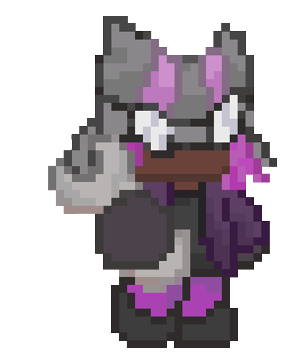

# OVERLOADED 🐺🤖

 

**OVERLOADED** é um jogo do gênero *Roguelite Horde Survivor* top-down 2D, desenvolvido no Construct 3 para a **CrazyGames x Construct Game Jam**. 

## 📖 A História

Em um mundo caótico onde engrenagens e óleo ditam as regras da sobrevivência, conheça **Lizzie**, uma loba engenheira extremamente habilidosa, mecânica e destemida. Ela nunca entra em uma briga desarmada, utilizando sua inseparável Chave de Boca (Wrench Boomerang) para manter os inimigos à distância.

Mas o verdadeiro poder de Lizzie se revela no momento crítico. Quando as baterias inimigas são drenadas e ela atinge o limite da exaustão, sua invenção máxima entra em cena: **Archie**, um robô gigante de combate. 

Montada em Archie, Lizzie se torna literalmente **OVERPOWERED** (Sobrecarga), trucidando hordas inteiras com tiros de canhão e atropelamentos brutais.

## 🎮 Jogabilidade (Gameplay)

O jogo foca em uma experiência fluida, frenética e extremamente recompensadora. O Core Loop consiste em:
- **Sobrevivência Padrão:** O jogador controla Lizzie (movimentação em 8 direções isométricas). Ela ataca automaticamente inimigos próximos lançando sua Chave de Boca como um bumerangue.
- **Acúmulo de Energia:** Cada inimigo derrotado preenche a barra de *Sobrecarga*. A tela acompanha a evolução do perigo e tensão.
- **Modo Sobrecarga (OVERPOWERED):** Ao abater 50 inimigos, a barra atinge 100%. Lizzie chama Archie. O controle e o visual do personagem mudam instantaneamente. O jogador ganha novas habilidades devastadoras, como o *Recoil Cannon* e a habilidade de esmagar (Trample) inimigos correndo por cima deles. Inimigos ficam enfurecidos, mas você está... sobrecarregado!

## 🚀 Motivação (Crazy Web Game Jam)

Nossa motivação principal para participar da **CrazyGames x Construct Game Jam** é abraçar de cabeça o tema "OVERPOWERED" e traduzi-lo na sensação mais pura de gameplay. 

Em jogos de horda, passar minutos fugindo cria uma tensão que precisa ser liberada. Quisemos pegar o conceito de "ficar forte" e elevar à décima potência com a transição entre a mecânica de sobrevivência tática de Lizzie e o poder absoluto (Overpowered) de Archie.

Além disso, a oportunidade de desenvolver exclusivamente em **Construct 3** focando em web (HTML5) para rodar na plataforma da CrazyGames nos inspirou a aplicar técnicas de otimização pesadas, pixel art estilizado em Letterbox 16:9 (como recomendado nas guidelines da jam) e criar uma experiência focada na diversão e retenção, visando os critérios de **Fun**, **Visual** e **Innovation**.

Temos orgulho de criar um jogo divertido, com mecânicas sólidas e que proporciona aos jogadores a incrível sensação de invencibilidade que o tema pede.

---
*Desenvolvido por AuraOneStudios*

## License

This repository uses split licensing:

- **Code** (engine logic, scripts, tooling) is licensed under [MIT](./LICENSE) — free to use, modify, and redistribute.
- **Art, character designs, audio, and the OVERLOADED name/logo** under [`/assets`](./assets) are **all rights reserved** — see [`assets/LICENSE`](./assets/LICENSE). No reuse or redistribution is permitted without written consent from AuraOne Studios.
