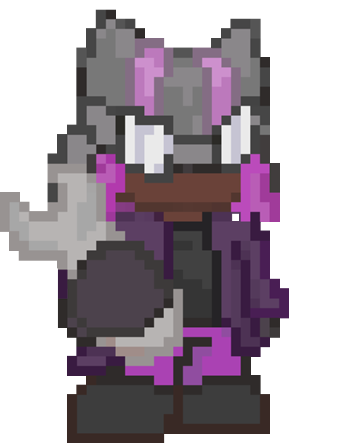

# OVERLOADED 🐺🤖

 

**OVERLOADED** is a 2D top-down *Roguelite Horde Survivor* game, developed in Construct 3 for the **CrazyGames x Construct Game Jam**. 

## 📖 The Story

In a chaotic world where gears and oil dictate the rules of survival, meet **Lizzie**, an extremely skilled, fearless engineer and mechanic wolf. She never goes into a fight unarmed, using her inseparable Wrench Boomerang to keep enemies at a distance.

But Lizzie's true power is revealed in the critical moment. When enemy batteries are drained and she reaches the limit of exhaustion, her ultimate invention comes into play: **Archie**, a giant combat robot. 

Riding Archie, Lizzie literally becomes **OVERPOWERED**, slaughtering entire hordes with cannon shots and brutal trampling.

## 🎮 Gameplay

The game focuses on a fluid, frantic, and extremely rewarding experience. The Core Loop consists of:
- **Standard Survival:** The player controls Lizzie (8-direction isometric movement). She automatically attacks nearby enemies by throwing her Wrench like a boomerang.
- **Energy Accumulation:** Every defeated enemy fills the *Overload* bar. The screen tracks the evolution of danger and tension.
- **Overload Mode (OVERPOWERED):** Upon taking down 50 enemies, the bar reaches 100%. Lizzie summons Archie. The character's controls and visuals change instantly. The player gains devastating new abilities, such as the *Recoil Cannon* and the ability to trample enemies by running over them. Enemies become furious, but you are... overpowered!

## 🚀 Motivation (Crazy Web Game Jam)

Our main motivation for participating in the **CrazyGames x Construct Game Jam** is to dive headfirst into the "OVERPOWERED" theme and translate it into the purest sensation of gameplay. 

In horde games, spending minutes running away builds a tension that needs to be released. We wanted to take the concept of "getting strong" and elevate it to the nth degree with the transition between Lizzie's tactical survival mechanics and Archie's absolute power (Overpowered).

Furthermore, the opportunity to develop exclusively in **Construct 3** focusing on the web (HTML5) to run on the CrazyGames platform inspired us to apply heavy optimization techniques, stylized pixel art in 16:9 Letterbox (as recommended in the jam guidelines), and create an experience focused on fun and retention, targeting the criteria of **Fun**, **Visual**, and **Innovation**.

We are proud to create a fun game with solid mechanics that provides players with the incredible feeling of invincibility the theme calls for.

---
*Developed by AuraOne Studios®*

## License

This repository uses split licensing:

- **Code** (engine logic, scripts, tooling) is licensed under [MIT](./LICENSE) — free to use, modify, and redistribute.
- **Art, character designs, audio, and the OVERLOADED name/logo** under [`/assets`](./assets) are **all rights reserved** — see [`assets/LICENSE`](./assets/LICENSE). No reuse or redistribution is permitted without written consent from AuraOne Studios®.
